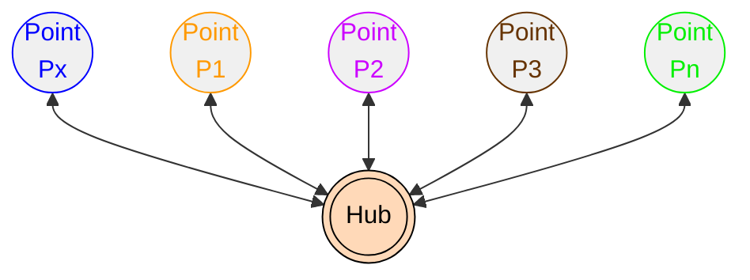
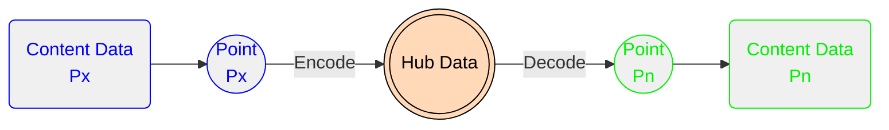
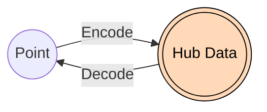

# xl8r

The xl8r package is a library written in Go that facilitates development of "spoke and hub" translators.

**Spoke and Hub:**

More on xl8r "spoke and hub" paradigm

In this paradigm, each point represents a different Origin and/or Destination for data translations.

For example, some content may be translated from `Point P1` to `Point P3`, where:
- `Point P1` is called "english"
- `Point P3` is called "spanish"
- the content to be translated is the value `string` "four"

In this example (and the `xl8r` package), `Point P1` is considered as the _Origin_ and `Point P3` as the _Destination_.

The _Hub_ represents a commonality between _all points_ in the system.
- the hub data, in this example, is the value `int` 4

The _Spoke_ represents the path to and from `Point` and `Hub`.
- from `Point` (_Origin_) to `Hub`, "content data" is converted to "hub data"  (ie. _Encoded_)
- from `Hub` to `Point` (_Destination_), "hub data" is converted to "content data"  (ie. _Decoded_)

Summarizing the "english" to "spanish" translation, in _spoke and hub_ terms:
- from "english": (`Point P1`) convert value `string` "four" to value `int` 4 (`Hub`)
- to "spanish": (`Hub`) convert value `int` 4 to value `string` "cuatro" (`Point P3`)

In 

