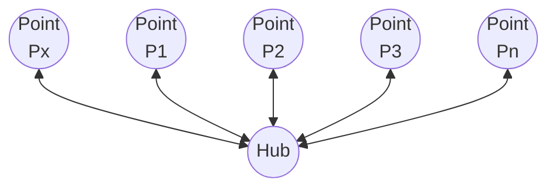
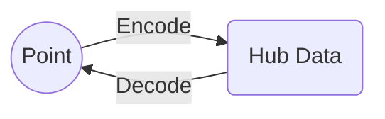
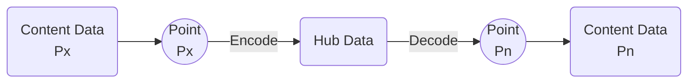

# xl8r

The xl8r package is a library written in Go that facilitates development of "spoke and hub" translators.

**Spoke and Hub:**

```mermaid
graph TD;
  X((Point<br>Px))<-->H((Hub));
  A((Point<br>P1))<-->H((Hub));
  B((Point<br>P2))<-->H((Hub));
  C((Point<br>P3))<-->H((Hub));
  N((Point<br>Pn))<-->H((Hub));
```

```mermaid
graph LR
  A((Point)) -- Encode --> H(Hub Data)
  H(Hub Data) -- Decode --> A((Point))
```

```mermaid
graph LR
  D1(Content Data<br>Px) --> A((Point<br>Px))
  A((Point<br>Px)) -- Encode --> H(Hub Data)
  H(Hub Data) -- Decode --> C((Point<br>Pn))
  C((Point<br>Pn)) --> D2(Content Data<br>Pn)
```
